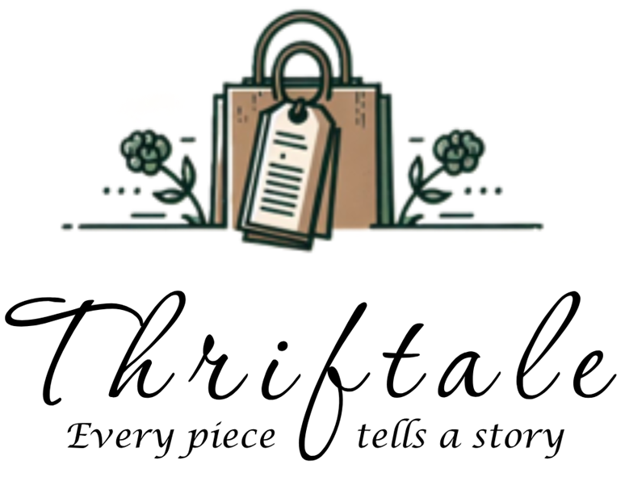
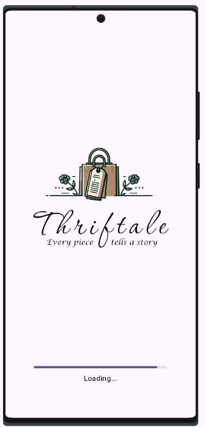
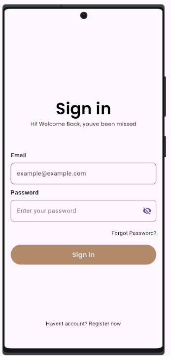
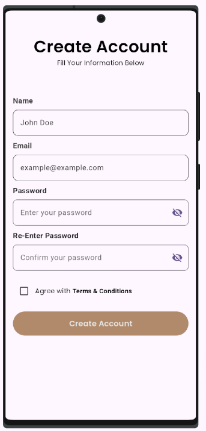
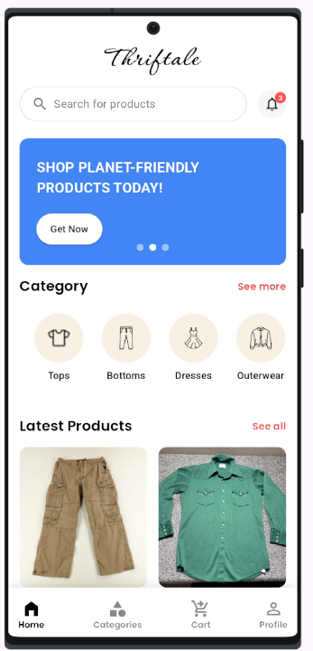
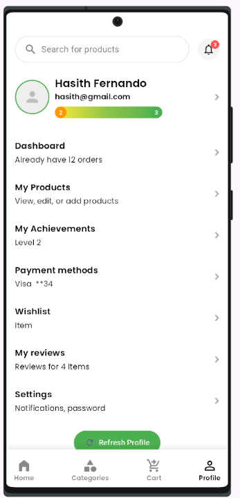
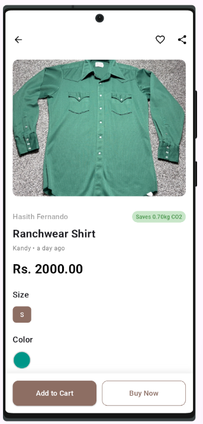
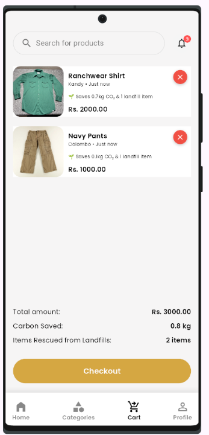
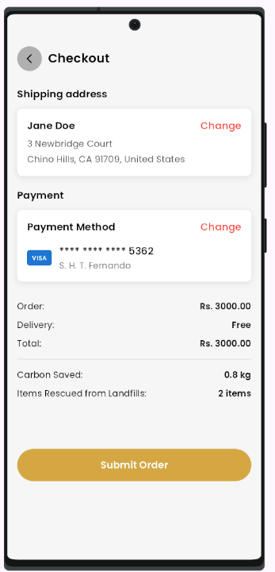
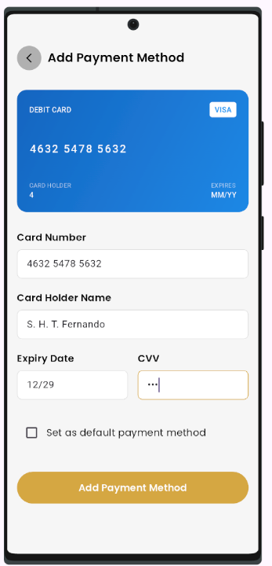

# ♻️ **Thriftale – Sustainable Thrift Shopping App**

> _“Shop smart. Shop sustainable. Shop with Thriftale.”_

Thriftale is a modern **Flutter-based mobile application** built to encourage **eco-conscious shopping** by letting users **buy and sell second-hand fashion items**. Track your environmental impact through **carbon savings** and **waste reduction**—and join the sustainable style movement!

<div align="center">  </div>

## 🚀 Features at a Glance

-   👤 **User Authentication** – Sign up and login seamlessly
    
-   🛍️ **Product Listings** – Add images, descriptions & categorize items
    
-   🔍 **Search & Filter** – Browse by category, price, and location
    
-   🛒 **Smart Cart System** – Track your **CO₂** and **landfill savings**
    
-   ✅ **Secure Checkout** – No duplicate buys – thrift = unique!
    
-   🌱 **Sustainability Tracker** – See your positive environmental impact
    
-   💬 **Seller Ratings & Reviews** – Build trust within the community

## 🛠️ Tech Stack


|Frontend			|Backend	|Cloud
|  :----------------:  |  :------:  |  :----:  |
|Flutter & Dart		|Firebase Cloud Functions | Firebase Firestore & Storage
|Material Design|Firebase Auth|Firebase Notifications

## 📸 App Screenshots

<div align="center">      <br/>      </div>

## 👥 Meet the Team

> ✨ **Thanks to our amazing team!** 💚

[](https://github.com/HasithFernando)  [](https://github.com/HiruniChathurya)  
[](https://github.com/GDDDilshan)  [](https://github.com/SadeeshaJayaweera)  
[](https://github.com/ThisangiRanasinghe)  [](https://github.com/nisandi)  
[](https://github.com/ahcwasana)  [](https://github.com/ChamudithaHAP)

----------

## 📁 Project Structure

```
lib/
├── models/         # Data models (e.g., Product, User)
├── pages/          # UI screens/pages
├── services/       # Business logic and Firebase services
├── utils/          # Constants, formatters, helpers
└── widgets/        # Reusable UI components

```

## 🧪 Getting Started

Follow these steps to run Thriftale locally:

1.  **Clone the repository**
    
    ```bash
    git clone https://github.com/HasithFernando/MAD-Project.git
    cd MAD-Project
    ```
    
2.  **Install dependencies**
    
    ```bash
    flutter pub get
    ```
    
3.  **Configure Firebase**
    
    -   Add `google-services.json` (for Android)
        
    -   Add `GoogleService-Info.plist` (for iOS)
        
4.  **Run the app**
    
    ```bash
    flutter run
    ```    

## 💡 Inspiration

> Born from a desire to reduce fashion waste, **Thriftale** is more than just an app—it's a movement.  
> We aim to empower a **community-first thrift platform** that rewards users for making greener choices.

<div align="center"> 🌍 *Sustainable style starts with you.* ♻️ *Choose pre-loved. Choose Thriftale.* </div>